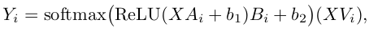
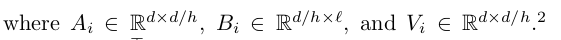

# mingpt_birthdate_qa

This project has been slightly adapted from an assignment in Chris Manning's professional level class at Stanford called Deep Learning for NLP, aka  XCS224N. The codebase has forked Andrej Karpathy’s [minGPT](https://github.com/karpathy/minGPT), based on the Transformer language model of OpenAI,
originally described in this paper [1] 

The first goal of the assignment was to pretrain the model on Wikipedia data and then fine tune it on birthplace QA data, in the form of the following: 

*Q: Where was [person] born?*\
*A: [place]*

I wrote the code to pretrain and finetune the model, located in helper.py. I also wrote the code for performing span corruption, as discussed in the T5 paper [2]. Span corruption randomly replaces spans of text in the training data with noise. My implementation simplifies the approach by only masking one sequence of text per training example. The code for this can be found in the CharCorruptionDataset class of dataset.py
To build and evaluate the basic version of the model, do the following:
```
# Pretrain the model
./run.sh vanilla_pretrain
# Finetune the model
./run.sh vanilla_finetune_with_pretrain
# Evaluate on the dev set; write to disk
./run.sh vanilla_eval_dev_with_pretrain
# Evaluate on the test set; write to disk
./run.sh vanilla_eval_test_with_pretrain
```

The next part of the assignment was to implement an alternative scoring function for the self-attention component of the transformer architecture. While the vanilla version of the model performs a dot product between pairs of word vectors (making the computation quadratic in sequence length), *synthesized attention* [3] removes this dot product with the following:



My code for this function is found in the forward function of SynthesizerAttention, located in attention.py.

To train and evaluate on this variant form of attention, do the following: 
```
# Pretrain the model
./run.sh synthesizer_pretrain
# Finetune the model
./run.sh synthesizer_finetune_with_pretrain
# Evaluate on the dev set; write to disk
./run.sh synthesizer_eval_dev_with_pretrain
# Evaluate on the test set; write to disk
./run.sh synthesizer_eval_test_with_pretrain
```

[1] Radford, A., Narasimhan, K., Salimans, T., and Sutskever, I. Improving language understanding with
unsupervised learning. Technical report, OpenAI (2018).\
[2] Raffel, C., Shazeer, N., Roberts, A., Lee, K., Narang, S., Matena, M., Zhou, Y., Li, W., and
Liu, P. J. Exploring the limits of transfer learning with a unified text-to-text transformer. Journal of Machine
Learning Research 21, 140 (2020), 1–67.\
[3] Tay, Y., Bahri, D., Metzler, D., Juan, D.-C., Zhao, Z., and Zheng, C. Synthesizer: Rethinking
self-attention in transformer models. arXiv preprint arXiv:2005.00743 (2020).